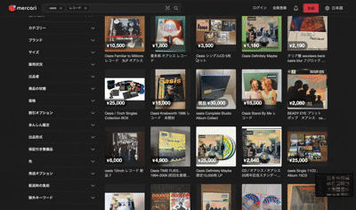

# discogs-price-extension-backend
<p align="center">
  
</p>
このプロジェクトは、Electronベースのバックエンドアプリケーションで、Discogs（ディスコグス）の価格拡張機能を提供します。主に、Vinylレコードのメタデータ抽出、Electronの特性を活かしたスクレイピング、Google Gemini AIとの統合を行います。

## 実際の動作


## 機能

- **Electronアプリケーション**: クロスプラットフォームのデスクトップアプリケーションとして動作します。
- **API処理**:
  - Google Gemini AIを使用したVinylレコードのメタデータ抽出。
  - ElectronのChromiumベースのブラウザエンジンを活用したウェブスクレイピング。
  - Expressサーバーを介したAPIエンドポイント（例: `/api/v1/gemini`）。
- **スクレイピングキュー**: ScrapeQueueクラス（Electronの特性を活かして）で並列スクレイピングを管理。
- **環境設定**: .envファイルを使用してAPIキーや設定を管理。

## インストール

1. リポジトリをクローンします。

   ```
   git clone <repository-url>
   cd discogs-price-extension-backend
   ```

2. 依存関係をインストールします。

   ```
   npm install
   ```

3. 環境変数を設定します。`.env`ファイルを作成し、以下の変数を設定してください。
   ```
   REACT_APP_GEMINI_API_KEY=your-gemini-api-key
   REACT_APP_ACCESS_TOKEN=your-access-token
   REACT_APP_POOL_SIZE=5
   ```

## 開発

開発サーバーを起動するには、以下のコマンドを実行します。

```
npm run dev
```

バックエンドのみをビルドして実行するには:

```
npm run build-backend
npm run serve-backend
```

## ビルド

### 一般ビルド

TypeScriptをコンパイルしてViteでビルド:

```
npm run build
```

### Electronアプリケーションのビルド

Electronアプリケーションを各プラットフォーム向けにビルドします。ビルド前にTypeScriptをコンパイルしてください。

#### macOS (ARM64)

```
npm run build-electron-mac
```

#### Windows (x64)

```
npm run build-electron-win
```

#### Linux (x64)

```
npm run build-electron-linux
```

ビルドされたアプリケーションは、`electron-discogs-price-extension-<platform>-<arch>/`ディレクトリに配置されます。

### Webpackビルド

本番環境向けのWebpackビルド:

```
npm run build:webpack
```

## 使用方法

アプリケーションを起動するには:

```
npm run start
```

これにより、Electronウィンドウが開き、バックエンドAPIサーバーが起動します。

APIエンドポイントの例:

- `POST /api/v1/gemini`: Gemini AIを使用してメタデータを抽出。

## プロジェクト構造

- `src/backend/`: バックエンドコード
  - `main.ts`: Electronメインエントリーポイント
  - `electronServer.ts`: ExpressサーバーとAPI処理
  - `NeonApi.ts`: Gemini AI統合
  - `playwrightScrapeQueue.ts`: スクレイピングキュー
  - `scrapeQueue.ts`: Electronの特性を活かしたスクレイピングキュー
  - `server.ts`: サーバー関連
  - `type/`: 型定義ディレクトリ
- `dist/`: ビルド出力
- `electron-discogs-price-extension-<platform>-<arch>/`: プラットフォーム別ビルド済みアプリケーション

## 依存関係

主要な依存関係:

- Electron: デスクトップアプリケーション
- Express: APIサーバー
- Playwright: ウェブスクレイピング
- @google/genai: Gemini AI API
- React, TailwindCSS: フロントエンド（該当する場合）
